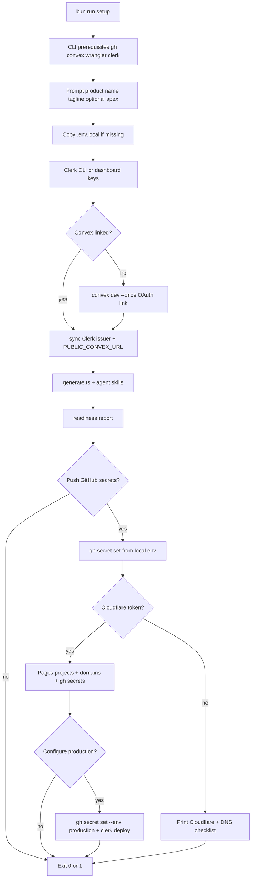

# Setup automation

What `bun run setup` automates, what stays manual, and dashboard URLs for fallbacks.

**Related:** [getting-started.md](./getting-started.md), [environments.md](./environments.md), [ci-cd.md](./ci-cd.md)

## Development vs Production during setup

Setup configures **two stacks**. Staging (`staging.*.pages.dev` on merge to `main`) uses the **Development** stack — not a third Clerk/Convex deployment.

| Setup step                        | Stack                  | What it configures                                                                                              |
| --------------------------------- | ---------------------- | --------------------------------------------------------------------------------------------------------------- |
| Convex + Clerk (first half)       | **Development**        | Clerk Development (`pk_test_…`), Convex **dev** deployment, `apps/web/.env.local`, dev webhook                  |
| GitHub Actions repository secrets | **Development**        | PR CI, Playwright, staging deploys on `main`                                                                    |
| Cloudflare Pages                  | **Production hosting** | Pages projects, apex DNS, deploy tokens (used by **both** staging branch deploys and release deploys)           |
| Production (release-* tags)       | **Production**         | Clerk Production (`pk_live_…` via `clerk deploy`), Convex **prod**, GitHub **`production`** environment secrets |

**Is Production fully set up?**

| Path                                            | Development                      | Production                                                                                                                                                                       |
| ----------------------------------------------- | -------------------------------- | -------------------------------------------------------------------------------------------------------------------------------------------------------------------------------- |
| **Happy path + apex**                           | Complete                         | Complete when setup exits 0 and summary shows `pk_live_` synced — release sign-in works on `*.pages.dev` and apex                                                                |
| **Happy path, no apex**                         | Complete                         | **Partial** — Convex prod + Pages may sync; Clerk Production **deferred** (no domain for `clerk deploy`); release **web sign-in will not work** until you add an apex and re-run |
| **Troublesome path** (ACTION REQUIRED / exit 1) | Usually complete up to the pause | **Incomplete** — fix the blocking step and re-run; nothing after the pause runs in that session                                                                                  |

Production is **not** always fully set up: only when `github.syncedSecrets.production` is true (needs `PUBLIC_CLERK_PUBLISHABLE_KEY` = `pk_live_…` plus Convex prod URL and deploy key) and, with an apex, `cloudflare.dnsConfigured` is true.

## Wizard behavior

- **Idempotent** (safe to re-run anytime): should not duplicate Clerk apps, corrupt [`.svelter/setup.json`](../.svelter/setup.json), or worsen secret placement. Interrupted runs resume; create-or-skip steps skip when already done. Prompts still run (with saved defaults); optional sync steps (GitHub secrets, Cloudflare) run again only when you confirm them.
- **Interactive** (local TTY): prompts run each time; previous answers from `.svelter/setup.json` are defaults (Enter keeps them).
- **Non-TTY** (CI, piped stdin): skip prompts; use existing `.svelter/setup.json` and env only. GitHub Actions secret sync, Cloudflare bootstrap, and production bootstrap require an interactive TTY — or pass `--sync-secrets` when `gh` / `CLOUDFLARE_API_TOKEN` are already set.
- Dashboard URLs appear as clickable links in setup output. Manual tiers:
  - **ACTION REQUIRED** — setup **exits**; finish the step, then re-run `bun run setup` (Convex not linked, Cloudflare zone missing, Clerk Production incomplete, registrar nameservers not delegated, etc.).
  - **→** (immediate) — do this **now** before the next prompt in the same run (e.g. create GCP OAuth client, then paste credentials; create Cloudflare zone in dashboard, then confirm lookup).
  - **→ Follow up:** — optional or informational only; setup continues (skipped optional steps, agent skills install warnings).

Step-by-step summary: [getting-started.md](./getting-started.md#2-setup-wizard-bun-run-setup).

## Config persistence

### `.svelter/setup.json` (local, no secrets)

Gitignored in the template repo — created on first `bun run setup`. Stores identity defaults, Cloudflare Pages project names, and which bootstrap steps already ran so re-runs stay idempotent. **Fork maintainers** who want non-interactive CI (`--sync-secrets`) can commit theirs after setup: `git add -f .svelter/setup.json`.

```json
{
  "productName": "My App",
  "productTagLine": "Short marketing tagline",
  "apexDomain": "example.com",
  "github": {
    "org": "acme",
    "repo": "my-app",
    "labelsSynced": true,
    "syncedSecrets": {
      "repo": true,
      "production": true,
      "cloudflare": true
    }
  },
  "cloudflare": {
    "synced": true,
    "dnsConfigured": true,
    "accountId": "…",
    "projectNameWeb": "my-app-web",
    "projectNameMarketing": "my-app-marketing"
  },
  "removeMitLicense": true
}
```

- `github.labelsSynced` — issue/PR labels created via `gh label create` (one-time).
- `github.syncedSecrets.repo` — repository secrets for PR CI / E2E (dev Convex + Clerk).
- `github.syncedSecrets.cloudflare` — repository secrets for Cloudflare Pages deploy workflows.
- `github.syncedSecrets.production` — GitHub **production** environment secrets for `release-*` releases.
- `cloudflare.synced` — Pages projects and domains configured (not a GitHub sync step).
- `cloudflare.dnsConfigured` — Cloudflare DNS / custom domains confirmed when an apex domain is set.

Also writes `packages/config/product.ts`, rebrands `README.md` when forking from the template, and optionally replaces MIT [`LICENSE`](../LICENSE).

### Secrets (never in `.svelter/`)

| Location                        | Contents                                                 |
| ------------------------------- | -------------------------------------------------------- |
| `apps/web/.env.local`           | `PUBLIC_*`, `CLERK_SECRET_KEY`, `E2E_USER_EMAIL`         |
| Root `.env.local`               | `CONVEX_DEPLOYMENT`, optional `CONVEX_DEPLOY_KEY`        |
| `.svelter/clerk-production.env` | Clerk Production keys from `clerk env pull` (gitignored) |
| GitHub Actions secrets          | CI and deploy keys                                       |
| CI build env (Actions)          | `PUBLIC_*` baked at compile time — not Pages dashboard   |

---

## Automated vs manual

### Still manual or checklist-only

| Area                     | Today                                                                                                                                                                                                                                                                                                                                                                  |
| ------------------------ | ---------------------------------------------------------------------------------------------------------------------------------------------------------------------------------------------------------------------------------------------------------------------------------------------------------------------------------------------------------------------- |
| Account signup / billing | Convex, Clerk, Cloudflare, GitHub dashboards                                                                                                                                                                                                                                                                                                                           |
| Convex first link        | Setup runs `convex dev --once` (OAuth in the same terminal); sets Clerk issuer and re-pushes                                                                                                                                                                                                                                                                           |
| Clerk app creation       | [Clerk CLI](https://clerk.com/docs/cli) (`clerk apps create`, `clerk env pull`) when authenticated; dashboard fallback                                                                                                                                                                                                                                                 |
| Clerk JWT template       | Automated via Backend API when `CLERK_SECRET_KEY` is set; manual dashboard fallback on failure                                                                                                                                                                                                                                                                         |
| Clerk webhook → Convex   | Interactive setup prompts for signing secret after Clerk Dashboard steps (or reads web env) — [details](#clerk-webhook-to-convex-profile-sync)                                                                                                                                                                                                                         |
| Clerk allowed origins    | Automated via Backend API when `CLERK_SECRET_KEY` is set; manual PATCH fallback on failure                                                                                                                                                                                                                                                                             |
| Google OAuth + One Tap   | Guided GCP checklist; enables connection via Clerk CLI `config patch` when linked; prompts for credentials and patches Clerk (manual dashboard fallback)                                                                                                                                                                                                               |
| Apex domain              | Optional in identity wizard (Enter to skip). Prints a **Cloudflare-first DNS** checklist when set. Re-run setup to add a domain later.                                                                                                                                                                                                                                 |
| DNS at registrar         | When apex is set: setup creates the Cloudflare zone (API or **Domains → Add a domain**), creates **Pages CNAMEs** (proxied apex + www), syncs Clerk CNAMEs from the **Clerk Domains API** (`.svelter/clerk-{apex}.zone` BIND fallback), attaches Pages domains, then **pauses** with generic registrar nameserver steps until you confirm (`cloudflare.dnsConfigured`) |
| E2E test user            | Wizard defaults `e2e.test@{apex}` when apex is set, else `e2e.test@example.com`; creates user via Clerk API and writes `E2E_USER_EMAIL`                                                                                                                                                                                                                                |
| Org GitHub policies      | Branch protection, required reviewers — outside setup                                                                                                                                                                                                                                                                                                                  |

### Feasibility summary

| Category    | Examples                                                                                                                                                                                                                                                       |
| ----------- | -------------------------------------------------------------------------------------------------------------------------------------------------------------------------------------------------------------------------------------------------------------- |
| **Script**  | `PRODUCT_NAME`, `PRODUCT_TAGLINE`, `.env.local`, `convex env set`, deploy keys, `gh secret set`, `gh label create`, Pages domains via API, Clerk DNS import to Cloudflare, Clerk JWT template + origins + webhook prep + Google OAuth enable/credentials patch |
| **Guided**  | Clerk CLI `env pull` or paste keys, inline Convex link, `wrangler login` or Cloudflare API token paste, DNS, E2E user, **Google Cloud OAuth client** (JavaScript origins + redirect URI)                                                                       |
| **Manual**  | Account signup, registrar nameserver change (when apex is set), Clerk email/password toggle (if E2E needs it), `release-*` release approval, org GitHub policies, Google Cloud project/consent screen                                                          |
| **Blocked** | Clerk setup without CLI login or dashboard access                                                                                                                                                                                                              |

---

## Platform URLs

Placeholders: `{org}`, `{repo}`, `{apex}`, `{cf-account}`, `{pages-web-project}`, `{pages-marketing-project}`.

**Derived hostnames** from apex `example.com`: see [environments.md](./environments.md#domains-and-dns).

| Surface   | Staging (merge to `main`)            | Production (`*.pages.dev`)   | Production (custom, optional) |
| --------- | ------------------------------------ | ---------------------------- | ----------------------------- |
| Web       | `staging.{slug}-web.pages.dev`       | `{slug}-web.pages.dev`       | `example.com`                 |
| Marketing | `staging.{slug}-marketing.pages.dev` | `{slug}-marketing.pages.dev` | `www.example.com`             |

Without an apex, setup can defer Clerk Production and still sync Convex + Cloudflare to the GitHub **`production`** environment. Clerk requires a domain you own before `pk_live_…` keys exist — not `*.pages.dev`. Re-run setup with an apex (or after `clerk deploy`) to finish Clerk and custom Cloudflare domains.

### Clerk

| Step                          | URL                                                                                                 |
| ----------------------------- | --------------------------------------------------------------------------------------------------- |
| Sign in / home                | [dashboard.clerk.com](https://dashboard.clerk.com)                                                  |
| Create application            | [dashboard.clerk.com/apps](https://dashboard.clerk.com/apps)                                        |
| API keys (Development)        | [API keys](https://dashboard.clerk.com/last-active?path=api-keys)                                   |
| API keys (Production)         | Same path; switch instance to Production                                                            |
| JWT templates → Convex preset | [JWT templates](https://dashboard.clerk.com/last-active?path=jwt-templates)                         |
| Webhooks (manual fallback)    | [Webhooks](https://dashboard.clerk.com/last-active?path=webhooks)                                   |
| Allowed origins (Development) | `PATCH /v1/instance` with `sk_test_…` (setup does this automatically)                               |
| Integrations → Convex         | [Integrations](https://dashboard.clerk.com/last-active?path=integrations)                           |
| SSO connections → Google      | [SSO connections](https://dashboard.clerk.com/last-active?path=user-authentication/sso-connections) |

After the app exists, setup pulls or prompts for `PUBLIC_CLERK_PUBLISHABLE_KEY` and `CLERK_SECRET_KEY`, derives `CLERK_JWT_ISSUER_DOMAIN`, and uploads it to Convex before the first successful function push. If Convex linking provisions a deployment before the issuer is set, setup detects the linked deployment, sets the env var, and retries the push automatically.

#### Google OAuth and One Tap

Google sign-in via the Clerk modal works with Clerk’s shared dev credentials. **Google One Tap** (prompt on `/tasks` when signed out) requires **custom Google OAuth credentials** in Clerk — even on Development instances.

When `CLERK_SECRET_KEY` is set and the Clerk issuer is known, setup:

1. Prints **Authorized JavaScript origins** (localhost, staging `*.pages.dev`, production URLs) and Clerk’s **OAuth redirect URI**
2. Guides **OAuth consent screen** on new GCP projects ([consent screen](https://console.cloud.google.com/apis/credentials/consent) — Credentials shows a yellow banner until configured), then a **Web application** OAuth client ([Credentials](https://console.cloud.google.com/apis/credentials))
3. Enables the Google SSO connection via `clerk config patch` when the project is linked (`clerk auth login` + `clerk link`). On an interactive run, prints a GCP-only checklist, then prompts for credentials and patches Clerk — **no Clerk dashboard paste** when the patch succeeds.
4. Prompts for `GOOGLE_OAUTH_CLIENT_ID` and `GOOGLE_OAUTH_CLIENT_SECRET` (or reads them from `apps/web/.env.local`) and patches Clerk. Manual **Configure → SSO connections → Google** steps appear only when the CLI patch fails.

**Google Cloud:** standard Sign-in OAuth clients are created in the [console](https://console.cloud.google.com/apis/credentials) only (no `gcloud` automation) — see feasibility table below.

**Production:** before interactive `clerk deploy`, setup prints a **linked checklist** (Google Cloud Console, OAuth consent, Credentials, Clerk SSO connections) with the exact JavaScript origins and redirect URI (`https://accounts.{apex}/v1/oauth_callback`), opens [Credentials](https://console.cloud.google.com/apis/credentials) in the browser, then runs the Clerk deploy wizard. At the Google OAuth prompt, choose **I already have my Client ID and Client Secret** and paste values from Google Cloud. Setup also repeats Google OAuth patching after deploy when `sk_live_…` keys are available.

Without custom credentials, Google One Tap will not render; the sign-in modal’s Google button may still work in Development.

#### Clerk webhook to Convex profile sync

Convex stores Clerk profile fields (`firstName`, `lastName`, `email`, `imageUrl`) for queries. JWT claims seed them on sign-in; the webhook keeps them authoritative when users change profile data in Clerk.

When `CLERK_SECRET_KEY` and a linked Convex deployment are present, setup (after the first Convex push):

1. Prints the webhook URL: `https://<deployment>.convex.site/clerk-webhook`
2. If `CLERK_WEBHOOK_SIGNING_SECRET` is in `apps/web/.env.local`, uploads it to the **dev** Convex deployment. On an interactive run, setup prompts for the signing secret after you create the endpoint (Enter to skip).

Create the endpoint in the [Clerk Dashboard](https://dashboard.clerk.com/last-active?path=webhooks):

1. **Add endpoint** → paste the URL from setup output
2. Subscribe to `user.created`, `user.updated`, `user.deleted`
3. Copy **Signing secret** → paste when setup prompts, or set `CLERK_WEBHOOK_SIGNING_SECRET` in `apps/web/.env.local` and re-run setup
4. Run `bun run dev:convex` and send a test event

**Production:** repeat for the Production Clerk instance and prod Convex deployment URL after the Production setup step — Development and Production use separate webhook endpoints and signing secrets.

Without the webhook, profile fields still populate on sign-in from JWT claims; they will not update when the user changes avatar or name in Clerk until the next sign-in.

### Convex

| Step                    | URL                                                                                          |
| ----------------------- | -------------------------------------------------------------------------------------------- |
| Dashboard               | [dashboard.convex.dev](https://dashboard.convex.dev)                                         |
| Login (CLI)             | `bunx convex login`                                                                          |
| Link / dev deployment   | `bun run dev:convex`                                                                         |
| Dev deployment settings | [Deployment settings](https://dashboard.convex.dev/t/{team}/{project}/{deployment}/settings) |
| Environment variables   | …/settings/environment-variables                                                             |
| Deploy keys             | …/settings/deploy-keys                                                                       |

When linked + Clerk issuer known, setup runs:

```bash
bunx convex env set CLERK_JWT_ISSUER_DOMAIN "https://your-app.clerk.accounts.dev"
bunx convex deployment token create github-ci --save-env
```

Setup also generates `ANON_AUTH_ISSUER`, `ANON_AUTH_JWKS`, and `ANON_AUTH_PRIVATE_KEY` on the **dev** deployment (guest JWT signing). The **Production** setup step repeats the same trio on the **prod** deployment using that deployment’s `.convex.site` issuer.

### Cloudflare Pages

| Step            | URL                                                                                  |
| --------------- | ------------------------------------------------------------------------------------ |
| Sign up         | [dash.cloudflare.com/sign-up](https://dash.cloudflare.com/sign-up)                   |
| Dashboard       | [dash.cloudflare.com](https://dash.cloudflare.com)                                   |
| API tokens      | [Profile → API Tokens](https://dash.cloudflare.com/profile/api-tokens) (CI fallback) |
| CLI login       | `bunx wrangler login` (setup uses OAuth session when no token is set)                |
| Workers & Pages | Account → Workers & Pages                                                            |
| Direct upload   | Create project **without** Git; deploy via `wrangler pages deploy` in GitHub Actions |

### GitHub

| Step            | URL                                                                            |
| --------------- | ------------------------------------------------------------------------------ |
| Actions secrets | [Repository secrets](https://github.com/{org}/{repo}/settings/secrets/actions) |
| Environments    | [Environments](https://github.com/{org}/{repo}/settings/environments)          |
| CLI auth        | `gh auth login -s repo,workflow` (setup requests both scopes)                  |

Setup creates the **`production`** environment via `gh api` when your token has `repo` + `workflow`. If creation fails with Forbidden, confirm scopes with `gh auth status` and run `gh auth refresh -h github.com -s repo,workflow`.

---

## CLI prerequisites

| Tool     | Login                                                  |
| -------- | ------------------------------------------------------ |
| `gh`     | `gh auth login -s repo,workflow`                       |
| Convex   | `bunx convex login`                                    |
| Wrangler | `bunx wrangler login` or `CLOUDFLARE_API_TOKEN` in env |
| Clerk    | `bunx clerk auth login`                                |

Setup probes these at the start of each interactive run. Missing tools print macOS `brew install …` hints or official docs URLs; you can continue in manual mode.

---

## Apex domain and DNS (Cloudflare-first)

When you set an apex domain in the identity wizard, setup assumes **DNS is hosted on Cloudflare**, not at your registrar. **You do not add CNAMEs by hand** — setup creates Pages and Clerk DNS records via the Cloudflare API. Your only manual DNS step is pointing **registrar nameservers** at Cloudflare when prompted.

1. **Cloudflare zone** — setup tries the API; fallback is Dashboard → **Domains → Add a domain** (not Workers & Pages). `wrangler login` can create Pages projects but **cannot** create DNS zones.
2. **Cloudflare Pages custom domains** — setup attaches `example.com` → web project and `www.example.com` → marketing project via API. Dashboard fallback (Custom domains tab on each Pages project) appears only if the API step fails.
3. **Pages DNS records** — proxied CNAMEs in Cloudflare DNS (`example.com` → `{web}.pages.dev`, `www` → `{marketing}.pages.dev`) are created automatically when the API token has Zone → DNS → Edit.
4. **Clerk production** — runs only after the Cloudflare zone exists. `clerk deploy` uses the **same** apex domain you entered earlier; Clerk CNAMEs are imported into **Cloudflare DNS** automatically (DNS-only / grey cloud).
5. **Clerk DNS sync** — after `clerk deploy`, setup fetches CNAME targets from `GET /v1/domains` (`sk_live_…`) and creates DNS-only records in Cloudflare. `clerk deploy` may write a BIND file at repo root; setup relocates it to `.svelter/clerk-{apex}.zone` as a fallback.
6. **Registrar** — setup prints **generic** nameserver steps (wording varies by OVH, Namecheap, etc.): switch to custom nameservers using the two values Cloudflare assigns **your** zone (copy from the zone Overview — do not use example hostnames from docs).

Re-run `bun run setup` after the zone exists and after registrar nameservers propagate.

---

## Setup flow



Identity also writes `PRODUCT_TAGLINE` to `packages/config/product.ts`, the marketing hero and page title, and the GitHub repo **About** description (via `gh api` when `gh auth login` is active).

---

## CLI reference

```bash
# Identity + readiness wizard (re-run anytime; Enter keeps previous answers)
bun run setup

# Non-interactive secret sync (requires gh auth + local env; skips confirm prompts)
bun run setup -- --sync-secrets

# Convex (repo-pinned — bunx)
bun run dev:convex
bunx convex env set CLERK_JWT_ISSUER_DOMAIN "https://….clerk.accounts.dev"
bunx convex deployment token create github-ci --save-env

# GitHub (global gh)
gh auth login -s repo,workflow
gh secret set CONVEX_DEPLOY_KEY < deploy-key.txt
gh secret set PUBLIC_CONVEX_URL --body "https://….convex.cloud"

# Cloudflare (repo-pinned — bunx)
bunx wrangler login
export CLOUDFLARE_API_TOKEN=…   # optional CI fallback
export CLOUDFLARE_ACCOUNT_ID=…
bunx wrangler pages deploy apps/web/build --project-name=my-app-web --branch=staging

# Clerk (repo-pinned — bunx)
bunx clerk auth login
bunx clerk env pull --file .env.local   # from apps/web
bunx clerk deploy                        # provision Production
```

---

## Security

- Never log secret values; mask in prompts (`pk_test_…`, `sk_test_…`).
- Deploy keys and `CLERK_SECRET_KEY` only in `.env.local`, GitHub Secrets, or CI env — never in `.svelter/setup.json` or git.
- `gh secret set` reads from stdin or env vars, not echo.
- Preview/dev share Clerk test users and Convex dev — never prod credentials in repository secrets ([environments.md](./environments.md)).
